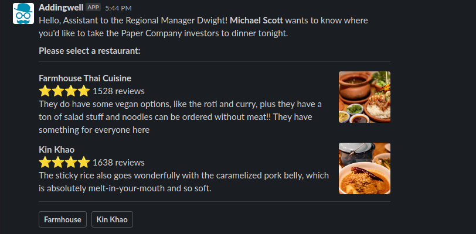

# Slack Enriched Message Tag

This tag allows you to send complex messages to slack. It leverages the [chat.postMessage](https://api.slack.com/methods/chat.postMessage) API.

To use this tag, you must have a Slack Application, you can do it this way:

1. Create a Slack Application on https://api.slack.com/apps?new_app=1
2. Chose "Incoming Webhooks" in the list of feature you want to install
3. Create a Webhook on the channel of your choice, and copy the link.
4. This link will be the value of `Slack Webhook URL` in GTM.

Then, you can create your complex message by using the Block Kit Builder: https://app.slack.com/block-kit-builder/.
What is in the `Payload` on the right of this page is what is required in the `Blocks` parameter.

As you're on GTM, you can use GTM Variable to render your message dynamically (in the tag, set `{{VariableName}}` that will be replaced by the variable).

## Example

Here's an example you can send to slack when using the default Block Kit Builder Example:

